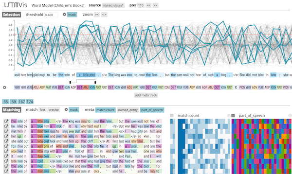
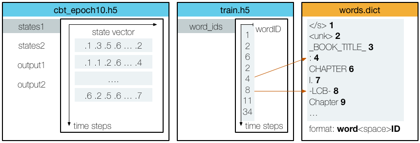

#  Visual Analysis for State Changes in RNNs

More information about LSTMVis, an introduction video, and the link to the live demo can be found at **[lstm.seas.harvard.edu](http://lstm.seas.harvard.edu)**

Also check out our new work on Sequence-to-Sequence models on [github](https://github.com/hendrikstrobelt/seq2seq-vis) or the live demo at **[http://seq2seq-vis.io/](http://seq2seq-vis.io/)**

<div style='text-align:center'>

</div>

## Changes in V2
- new design and server-backend
- discrete zooming for hidden-state track
- added annotation tracks for meta-data and prediction
- added training and extraction workflow for tensorflow
- client is now ES6 and D3v4
- some performance enhancements on client side
- Added Keras tutorial [here](docs/keras.md) (thanks to Mohammadreza Ebrahimi)


## Install

Please use python 2.7 to install LSTMVis.

Clone the repository:

```bash
git clone https://github.com/HendrikStrobelt/LSTMVis.git; cd LSTMVis
```

Install python (server-side) requirements using [pip](https://pip.pypa.io/en/stable/installing/):

```bash
pip install -r requirements.txt

on OSX 10.11 (El Capitan):
pip install --user -r requirements.txt
```

<!--Install [bower](https://bower.io/) (client side) requirements:

```bash
cd client; bower install; cd ..
```-->

Download & Unzip example dataset(s) into `<LSTMVis>/data/05childbook`:

[Children Book - Gutenberg](https://drive.google.com/file/d/0B542UFSlrvMjMHcxWHluNzh3clU/view?usp=sharing) - 2.2 GB

[Parens Dataset - 10k small](https://drive.google.com/file/d/0B3yX0IkfCkLvWUowazhOZHFuSms/view?usp=sharing) - 0.03 GB

start server:

```bash
python lstm_server.py -dir <datadir>
```

For the example dataset, use `python lstm_server.py -dir data`

open browser at [http://localhost:8888](http://localhost:8888/client/index.html) - eh voila !


## Adding Your Own Data

If you want to train your own data first, please read the [Training](docs/chapter/train.md) document. If you have your own data at hand, adding it to LSTMVis is very easy. You only need three files:

* HDF5 file containing the state vectors for each time step (e.g. `states.hdf5`)
* HDF5 file containing a word ID for each time step (e.g. `train.hdf5`)*
* Dict file containing the mapping from word ID to word (e.g. `train.dict`)*

A schematic representation of the data:




*If you don't have these files yet, but a space-separated `.txt` file of your training data instead, check out our [text conversion tool](docs/chapter/tools.md#convert-.txt-to-.h5-and-.dict)


### Data Directory
LSTMVis parses all subdirectories of `<datadir>` for config files `lstm.yml`.
A typical `<datadir>` might look like this:

```
<datadir>
├── paren  		        <--- project directory
│   ├── lstm.yml 		<--- config file
│   ├── states.hdf5 	        <--- states for each time step
│   ├── train.hdf5 		<--- word ID for each time step
│   └── train.dict 		<--- mapping word ID -> word
├── fun .. 
```


### Config File

a simple example of an `lstm.yml` is:

```yaml
name: children books  # project name
description: children book texts from the Gutenberg project # little description

files: # assign files to reference name
  states: states.hdf5 # HDF5 files have to end with .h5 or .hdf5 !!!
  train: train.hdf5 # word ids of training set
  words: train.dict # dict files have to end with .dict !!

word_sequence: # defines the word sequence
  file: train # HDF5 file
  path: word_ids # path to table in HDF5
  dict_file: words # dictionary to map IDs from HDF5 to words

states: # section to define which states of your model you want to look at
  file: states # HDF5 files containing the state for each position
  types: [
        {type: state, layer: 1, path: states1}, # type={state, output}, layer=[1..x], path = HDF5 path
        {type: state, layer: 2, path: states2},
        {type: output, layer: 2, path: output2}
  ]

```

## Intrigued ? Here is more.. 

Check out our documents about:

* [details about configuring the states file input](docs/chapter/config_states.md)
* [adding annotation files for result heatmaps](docs/chapter/meta.md)
* [training a model with torch](docs/chapter/train.md)
* NEW !!! [training a model with tensorflow (link)](https://github.com/sebastianGehrmann/tensorflow-statereader)
* [tools that make your life easier](docs/chapter/tools.md)


## Credits

LSTMVis is a collaborative project of Hendrik Strobelt, Sebastian Gehrmann, Bernd Huber, Hanspeter Pfister, and Alexander M. Rush at Harvard SEAS.
