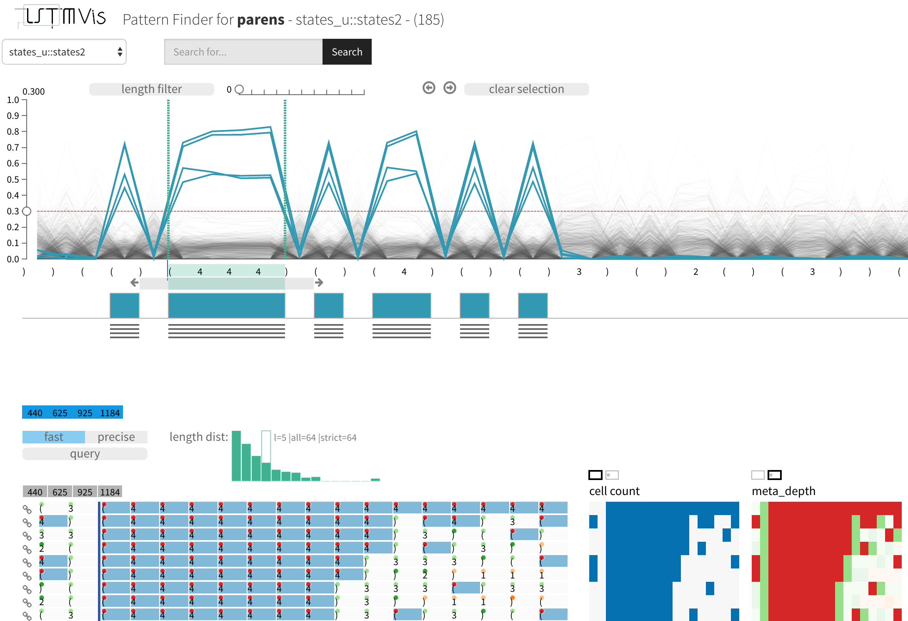

Welcome to LSTMVis's documentation!
===================================

Credits
=====
LSTMVis is a collaborative project of Hendrik Strobelt, Sebastian Gehrmann, Bernd Huber, Hanspeter Pfister, and Alexander Rush at Harvard SEAS.

Contents:

.. toctree::
   :maxdepth: 2

   chapter/install
   chapter/train
   chapter/tools

.. Indices and tables
.. ==================
..
.. * :ref:`genindex`
.. * :ref:`modindex`
.. .. * :ref:`search`
